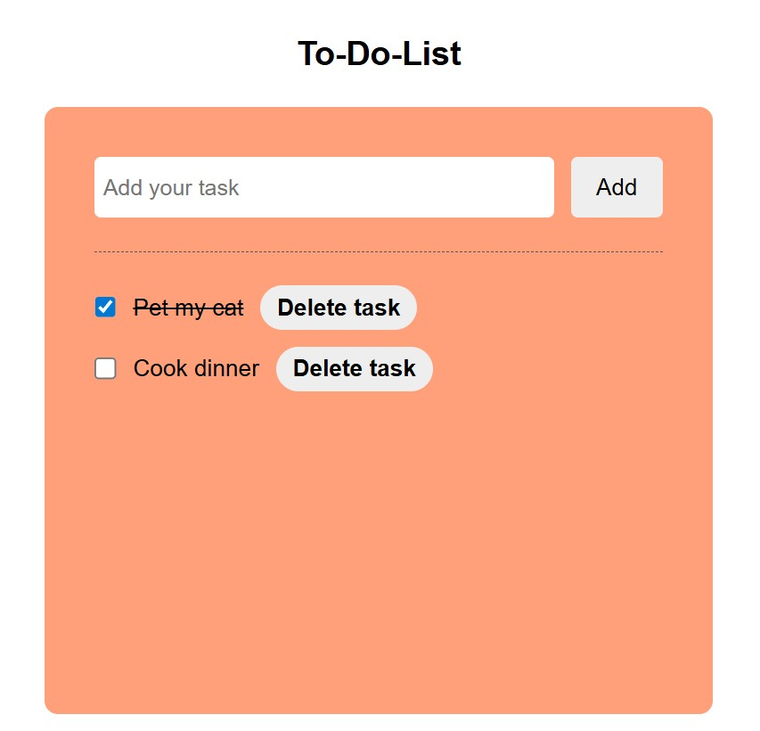

# 📝 To-Do List App — JavaScript Mini Project

This is a small learning project: an interactive to-do list built with **HTML**, **CSS**, and **vanilla JavaScript**, as part of my practice with mini projects.

## 🚀 Features

- Add tasks to the list  
- Mark tasks as completed using checkboxes  
- Strike through completed tasks  
- Delete tasks from the list  
- Simple and responsive layout with CSS  

## 📚 Concepts Practiced

- DOM manipulation with JavaScript (`querySelector`, `createElement`, `addEventListener`)  
- Dynamic content updates using `textContent` and `style`  
- Interactive checkboxes for task status  
- Layout design with CSS Flexbox  
- Separation of concerns: HTML (structure), CSS (style), JS (behavior)  

## 🖼️ Preview

Here’s what the To-Do List looks like:

  

  

